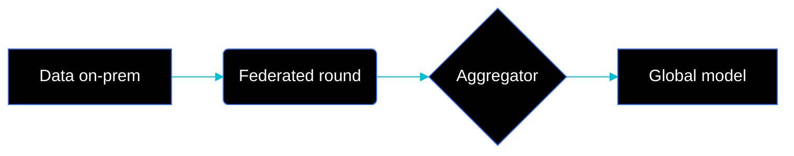

# Slidev / Reveal — FLock-styled HTML presentations

Use this when the user wants HTML/web presentations (live demo, embedded code, URL sharing). Slidev is preferred — it's Markdown-driven and the easiest way to produce branded slides at speed. Reveal.js fallback at the bottom.

> Load only when the task is "create / edit Slidev or Reveal slides". For PPTX, see `pptx.md`.

---

## Quick start

```bash
npm init slidev@latest flock-deck
cd flock-deck
npm i
npm run dev
```

Drop `flock-brand/assets/tokens.css` into the project, and the theme styles below into `style.css` (or `style/index.css`).

---

## `slides.md` skeleton

```md
---
theme: default
title: FLock.io — Real AI. Real Impact.
class: 'flock-page-dark'
fonts:
  sans: 'Inter, "Alibaba PuHuiTi 3.0", "PingFang SC", "Noto Sans SC", sans-serif'
  mono: 'JetBrains Mono, SF Mono, monospace'
download: true
exportFilename: 'flock-deck'
mdc: true
---

# Real AI. Real Impact.

FLock.io · 2026

<!-- COVER -->

---
class: 'flock-page-dark'
layout: default
---

# Sovereign AI

::FlockBadge::

- Federated learning for regulated data
- Compliance-grade audit trail
- Sovereign model deployment

---
class: 'flock-page-light'
layout: two-cols-header
---

# Why FLock

::left::

## Traditional AI
- Centralized training
- Data leaves your boundary
- Compliance friction

::right::

## FLock
- Federated by default
- Data never moves
- Compliance-native

---
class: 'flock-page-dark'
layout: statement
---

# "Real AI. Real Impact."
```

---

## Theme CSS — drop into `style.css`

```css
@import './tokens.css';                /* the FLock token file */

/* Page modes */
.flock-page-dark {
  background: var(--flock-bg-dark);
  color: var(--flock-text-on-dark);
}
.flock-page-light {
  background: var(--flock-bg-light);
  color: var(--flock-text-on-light);
}
.flock-page-brand {
  background: var(--flock-bg-brand);
  color: var(--flock-text-on-brand);
}

/* Slidev overrides */
.slidev-layout {
  font-family: var(--flock-font-primary);
}

/* Headings — Latin */
.slidev-layout h1 {
  font-size: 64px;
  line-height: 1.0;
  letter-spacing: -0.04em;
  font-weight: 700;
}
.slidev-layout h2 {
  font-size: 48px;
  line-height: 1.0;
  letter-spacing: -0.04em;
  font-weight: 500;
}
.slidev-layout h3 {
  font-size: 36px;
  line-height: 1.2;
  letter-spacing: -0.03em;
  font-weight: 500;
}

/* On light pages: H1/H2 in Brand Blue */
.flock-page-light h1, .flock-page-light h2 {
  color: var(--flock-brand-blue);
}

/* Body */
.slidev-layout p, .slidev-layout li {
  font-size: 24px;
  line-height: 1.2;
  letter-spacing: -0.03em;
  font-weight: 400;
}

/* CJK relax: don't crush Chinese with -4% tracking */
.slidev-layout :lang(zh) {
  letter-spacing: -0.01em !important;
  line-height: 1.4;
}

/* Cards (light mode) */
.flock-card {
  background: #FFFFFF;
  border: 1px solid var(--flock-border);
  border-radius: 12px;
  padding: 24px;
}

/* Subtle grid texture (extended convention) */
.flock-grid::before {
  content: '';
  position: absolute;
  inset: 0;
  background-image:
    linear-gradient(var(--flock-border) 1px, transparent 1px),
    linear-gradient(90deg, var(--flock-border) 1px, transparent 1px);
  background-size: 40px 40px;
  opacity: 0.06;
  pointer-events: none;
}
```

---

## `FlockBadge` Vue component

`components/FlockBadge.vue`:

```vue
<template>
  <div class="flock-badge">FLock.io</div>
</template>

<style scoped>
.flock-badge {
  position: absolute;
  top: 24px;
  right: 24px;
  background: var(--flock-brand-blue);
  color: #FFFFFF;
  padding: 4px 12px;
  border-radius: 9999px;
  font-family: var(--flock-font-primary);
  font-size: 14px;
  font-weight: 500;
  letter-spacing: -0.02em;
  z-index: 10;
}
</style>
```

Use in any slide via `<FlockBadge />` or as MDC: `::FlockBadge::`.

---

## Layout choices by archetype

When generating a deck, pick from this map. Each Slidev layout maps to a brand-approved use:

| Page archetype | Slidev layout | Mode | Hard limits |
|---|---|---|---|
| Cover / hero | `cover` | dark or brand | 1 title ≤ 8 CJK / 12 EN words; 1 subtitle ≤ 20 char; speaker line |
| Agenda | `default` (numbered list) | dark | 3–6 items, ≤ 10 char each |
| Section divider | `section` | dark | 1 large numeral (01/02/…) + 1 section title |
| Statement / quote | `statement` | brand or dark | 1 sentence ≤ 30 char, centered, large |
| Comparison (A vs B) | `two-cols-header` | dark or light | each side ≤ 4 bullets, ≤ 8 CJK chars per bullet |
| Three-pillar | `default` + 3-col grid | dark or light | exactly 3 cards; one card per pillar with its color (Blue/Teal/Purple) |
| Process / flow | `default` + Mermaid | either | 3–7 steps, arrows, no more than 7 |
| Data | `default` + ECharts/Vega-Lite | either | 1 chart + 1 takeaway sentence |
| Code | `default` with shiki | dark | ≤ 30 lines, monospace, line numbers |
| Team | `image-right` | either | photos in halftone Brand Blue duotone |
| CTA | `center` | brand | 1 primary CTA, ≤ 2 contact lines |
| End | `end` or `center` | brand | "谢谢 / Thank you" + URL |

---

## Mermaid + ECharts brand colors

### Mermaid (init block)



For light mode, swap `background: '#F2F2F2'`, `primaryTextColor: '#000000'`, and `mainBkg: '#FFFFFF'`.

### ECharts theme (chart.option)

```js
const FLOCK_DARK_THEME = {
  color: ['#3773FF', '#03BFD4', '#9C59F3', '#FF8B00', '#22B473'],
  backgroundColor: '#000000',
  textStyle: { fontFamily: 'Inter, sans-serif', color: '#FFFFFF' },
  title:  { textStyle: { color: '#FFFFFF', fontWeight: 500 } },
  legend: { textStyle: { color: '#FFFFFF' } },
  xAxis: { axisLine: { lineStyle: { color: '#FFFFFF' } }, splitLine: { show: false } },
  yAxis: { axisLine: { lineStyle: { color: '#FFFFFF' } },
           splitLine: { lineStyle: { color: '#FFFFFF', opacity: 0.1 } } },
};
```

---

## Export to PDF / PPTX

```bash
# PDF
slidev export --output flock-deck.pdf

# PPTX (each slide becomes one slide image — high-fidelity but not editable text)
slidev export --format pptx --output flock-deck.pptx
```

If the user needs **editable** PPTX (corporate handoff where they'll change text), regenerate via PptxGenJS using the recipes in `pptx.md` instead of exporting Slidev.

---

## Reveal.js fallback

If the user explicitly requires Reveal.js (e.g., embedding in an existing site):

```html
<!doctype html>
<html lang="zh-CN">
<head>
  <link rel="stylesheet" href="https://cdn.jsdelivr.net/npm/reveal.js@5/dist/reveal.css">
  <link rel="stylesheet" href="https://cdn.jsdelivr.net/npm/reveal.js@5/dist/theme/black.css" id="theme">
  <link rel="stylesheet" href="./flock-brand/assets/tokens.css">
  <style>
    .reveal { font-family: var(--flock-font-primary); letter-spacing: -0.03em; }
    .reveal h1, .reveal h2 { letter-spacing: -0.04em; line-height: 1.0; }
    .reveal h1 { font-size: 64px; font-weight: 700; }
    .reveal :lang(zh) { letter-spacing: -0.01em; }
  </style>
</head>
<body>
  <div class="reveal"><div class="slides">
    <section data-background-color="#3773FF">
      <h1 style="color:#fff">Real AI. Real Impact.</h1>
    </section>
    <section data-background-color="#000000">
      <h2 style="color:#3773FF">Sovereign AI</h2>
      <ul>
        <li>Federated learning for regulated data</li>
        <li>Compliance-grade audit trail</li>
      </ul>
    </section>
  </div></div>
  <script src="https://cdn.jsdelivr.net/npm/reveal.js@5/dist/reveal.js"></script>
  <script>Reveal.initialize();</script>
</body>
</html>
```

Reveal has no native layout system — every variation is hand-styled. Prefer Slidev.
